Optimization problems with orthogonality constraints arise throughout machine learning, including dimensionality reduction, clustering, and representation learning. These problems require the variable to lie on the *Stiefel manifold*, the set of matrices with orthonormal columns. While orthogonality improves interpretability and numerical stability, it also makes the feasible set nonconvex, and things get harder still when the objective contains a non-smooth sparsity-inducing term.

$$
\newcommand{\xm}{\mathbf{X}}
\newcommand{\am}{\mathbf{A}}
\newcommand{\bm}{\mathbf{B}}
\newcommand{\lm}{\mathbf{L}}
\newcommand{\hm}{\mathbf{H}}
\newcommand{\mm}{\mathbf{M}}
\newcommand{\gm}{\mathbf{G}}
\newcommand{\qm}{\mathbf{Q}}
\newcommand{\pm}{\mathbf{P}}
\newcommand{\um}{\mathbf{U}}
\newcommand{\vm}{\mathbf{V}}
\newcommand{\ym}{\mathbf{Y}}
\newcommand{\zm}{\mathbf{Z}}
\newcommand{\im}{\mathbf{I}}
\newcommand{\fm}{\mathbf{F}}
\newcommand{\vx}{\mathbf{x}}
\newcommand{\vy}{\mathbf{y}}
\newcommand{\vz}{\mathbf{z}}
\newcommand{\vc}{\mathbf{c}}
\newcommand{\vb}{\mathbf{b}}
\newcommand{\vu}{\mathbf{u}}
\newcommand{\vt}{\mathbf{t}}
\newcommand{\vg}{\mathbf{g}}
\newcommand{\vw}{\mathbf{w}}
\newcommand{\trace}{\operatorname{tr}}
\newcommand{\diag}{\operatorname{diag}}
\newcommand{\sign}{\operatorname{sign}}
\newcommand{\norm}[1]{\left\|#1\right\|}
\newcommand{\inner}[2]{\left\langle #1,#2 \right\rangle}
\newcommand{\pos}[1]{\left[#1\right]_+}
$$

A prominent example is *sparse principal component analysis* (sparse PCA), which enhances interpretability by enforcing sparsity on the principal components while keeping them orthogonal:

$$
\min_{\xm}\; -\frac{1}{2}\trace(\xm^\top \am^\top\am \xm)+\lambda\norm{\xm}_1
\quad\text{s.t.}\quad \xm^\top\xm=\im,
$$

where $\am$ is the data matrix (each row a sample), $\xm$ collects the principal components, and $\lambda$ controls the sparsity level. Similarly, *Sparse Spectral Clustering* (SSC) injects sparsity into spectral embeddings to improve robustness and interpretability in graph-based learning:

$$
\min_{\xm}\; \frac{1}{2}\trace(\xm^\top \lm \xm)+\lambda\norm{\xm}_1
\quad\text{s.t.}\quad \xm^\top\xm=\im,
$$

where $\lm$ is a graph Laplacian. The same template covers many more models: **unsupervised feature selection** replaces the $\ell_1$ norm with the row-sparsity-promoting $\ell_{2,1}$ norm, and **compressed modes in physics** seeks spatially localized solutions of the independent-particle Schrödinger equation by taking the quadratic term to be a discretized Schrödinger operator $\hm$. In every case the difficulty is the same: a **non-smooth sparsity term sitting on top of a nonconvex orthogonality constraint**.

Existing solvers largely fall into two camps. *Riemannian* methods (ManPG, ManPG-Ada, RADMM, ARADMM, OADMM) operate directly on the Stiefel manifold and preserve feasibility via retractions or projections, but they typically need repeated manifold operations or per-iteration line searches, which become expensive at scale. *Relaxation or splitting* methods decouple sparsity from orthogonality, but may sacrifice feasibility or introduce approximation error (e.g., Moreau-envelope smoothing of the regularizer). In this blog we discuss an algorithm which employs the former: an **Alternating Direction Proximal Method of Multipliers (ADPMM)** that handles the orthogonality constraint *without relaxation*, and whose per-iteration work reduces to one Stiefel projection plus one element-wise soft-thresholding.

## From ADMM to ADPMM

Recall the classical Alternating Direction Method of Multipliers (ADMM). For a separable problem

$$
\min_{\vx,\vz}\; H(\vx,\vz)=h_1(\vx)+h_2(\vz)
\quad\text{s.t.}\quad \am\vx+\bm\vz=\vc,
$$

ADMM works on the augmented Lagrangian with dual variable $\vy$ and penalty $\rho>0$:

$$
L_\rho(\vx,\vz,\vy)=h_1(\vx)+h_2(\vz)+\vy^\top(\am\vx+\bm\vz-\vc)+\frac{\rho}{2}\norm{\am\vx+\bm\vz-\vc}^2,
$$

alternating a minimization over $\vx$, a minimization over $\vz$, and a dual ascent step on $\vy$. ADMM is simple and effective, but its performance can deteriorate when the subproblems are ill-conditioned or lack strong convexity; as we will see, the plain $\vx$-subproblem for sparse PCA is *not* something we can solve in closed form.

ADPMM fixes this by adding a quadratic **proximal term** to each primal update. For two positive semidefinite matrices $\gm$ and $\qm$, with $\norm{\vx}_\gm^2=\vx^\top\gm\vx$:

**Algorithm 1 (ADPMM).**

**Input:** initial $\vx,\vy,\vz$; penalty $\rho$; proximal matrices $\gm,\qm$.

1. For $k=0,1,2,\ldots$:

   1. $$\vx^{k+1}\in\arg\min_\vx\Big\{h_1(\vx)+\frac{\rho}{2}\norm{\am\vx+\bm\vz^k-\vc+\tfrac{1}{\rho}\vy^k}^2+\frac{1}{2}\norm{\vx-\vx^k}_\gm^2\Big\}$$

   2. $$\vz^{k+1}\in\arg\min_\vz\Big\{h_2(\vz)+\frac{\rho}{2}\norm{\am\vx^{k+1}+\bm\vz-\vc+\tfrac{1}{\rho}\vy^k}^2+\frac{1}{2}\norm{\vz-\vz^k}_\qm^2\Big\}$$

   3. $$\vy^{k+1}=\vy^k+\rho(\am\vx^{k+1}+\bm\vz^{k+1}-\vc)$$

When $\gm=\qm=\mathbf{0}$, ADPMM degenerates to vanilla ADMM. The proximal terms play two roles: they **stabilize** the updates by penalizing large deviations from the previous iterate, and they can be chosen to **cancel inconvenient quadratic terms** in the objective, turning an otherwise hard subproblem into a closed-form one.

## Solving Sparse PCA and SSC via ADPMM

To put sparse PCA into the ADPMM template, introduce an auxiliary variable $\zm$ that carries the sparsity term, leaving the orthogonality constraint on $\xm$:

$$
\begin{aligned}
\min_{\xm,\zm}\quad & -\frac{1}{2}\trace(\xm^\top\am^\top\am\xm)+\lambda\norm{\zm}_1\\
\text{s.t.}\quad & \xm^\top\xm=\im,\qquad \xm=\zm.
\end{aligned}
$$

Now design the proximal matrices. In the $\xm$-update, the objective contributes the concave quadratic $-\frac{1}{2}\trace(\xm^\top\am^\top\am\xm)$. Choosing

$$
\gm=\am^\top\am
$$

**exactly cancels this quadratic**: the proximal term $\frac{1}{2}\norm{\xm-\xm^k}_\gm^2$ expands to $\frac{1}{2}\trace(\xm^\top\am^\top\am\xm)$ plus terms linear in $\xm$. What remains of the $\xm$-subproblem is a linear function of $\xm$ plus $\frac{\rho}{2}\norm{\xm-\zm^k+\tfrac{1}{\rho}\ym^k}_F^2$, restricted to the Stiefel manifold; this is the **Orthogonal Procrustes problem**, solved in closed form by the SVD:

$$
\xm^{k+1}=\um\vm^\top,
\qquad
\um\Sigma\vm^\top=\operatorname{svd}\big(\rho\zm^k-\ym^k+\gm\xm^k\big).
$$

Since the $\zm$-update has no quadratic term, we simply take $\qm=\mathbf{0}$, and the update reduces to element-wise **soft-thresholding**:

$$
\zm^{k+1}=\mathcal{S}_{\lambda/\rho}\Big(\xm^{k+1}+\tfrac{1}{\rho}\ym^k\Big),
\qquad
\mathcal{S}_{\tau}(\xm)=\sign(\xm)\odot\max(|\xm|-\tau,0).
$$

**Algorithm 2 (ADPMM for Sparse PCA).**

**Input:** initial $\xm,\ym,\zm$; penalty $\rho$; data matrix $\am$. Set $\gm=\am^\top\am$.

1. For $k=0,1,2,\ldots$:

   1. Compute $\operatorname{svd}(\rho\zm^k-\ym^k+\gm\xm^k)=\um\Sigma\vm^\top$.

   2. $$\xm^{k+1}=\um\vm^\top \quad (\text{or via the Newton–Schulz iteration of Algorithm 3})$$

   3. $$\zm^{k+1}=\mathcal{S}_{\lambda/\rho}\big(\xm^{k+1}+\tfrac{1}{\rho}\ym^k\big)$$

   4. $$\ym^{k+1}=\ym^k+\rho(\xm^{k+1}-\zm^{k+1})$$

The Sparse Spectral Clustering case is identical except that the quadratic is $+\frac{1}{2}\trace(\xm^\top\lm\xm)$, a *convex* term we cancel with

$$
\gm=\lambda_{\max}(\lm)\,\im-\lm,
$$

where the shift by $\lambda_{\max}(\lm)$ ensures $\gm\succeq 0$ so the proximal term is a valid Bregman-like penalty. Every other line of the algorithm is unchanged. Thus, **one framework, two problems**; with the obvious substitutions, the unsupervised feature selection and compressed-modes models as well (for the $\ell_{2,1}$ norm, soft-thresholding is replaced by its row-wise group analogue).

Each iteration therefore costs one matrix multiplication, one orthogonalization, and one entrywise shrinkage. **No retractions, no line searches, no smoothing of the regularizer**.

## Convergence Analysis

When $h_1$ and $h_2$ are proper, closed and convex and the proximal matrices make the subproblems strongly convex (our Hypothesis 1), ADPMM enjoys an ergodic $\mathcal{O}(1/n)$ rate in both objective gap and feasibility violation.

**Theorem 1.**
Let $\{(\vx^k,\vz^k)\}$ be generated by Algorithm 2 (or its SSC variant), let $(\vx^*,\vz^*)$ be an optimal primal solution and $\vy^*$ an optimal dual solution. Then, under Hypothesis 1, for any $\gamma>2\norm{\vy^*}$ and $n\ge 0$:

$$
H(\vx^{(n)},\vz^{(n)})-H(\vx^*,\vz^*)
\le
\frac{\norm{\vx^*-\vx^0}_\gm^2+\norm{\vz^*-\vz^0}_{\rho\im}^2+\frac{1}{\rho}(\gamma+\norm{\vy^0})^2}{2(n+1)},
$$

$$
\norm{\vx^{(n)}-\vz^{(n)}}
\le
\frac{\norm{\vx^*-\vx^0}_\gm^2+\norm{\vz^*-\vz^0}_{\rho\im}^2+\frac{1}{\rho}(\gamma+\norm{\vy^0})^2}{\gamma(n+1)},
$$

where $\vx^{(n)}=\frac{1}{n+1}\sum_{k=0}^n\vx^k$ and $\vz^{(n)}=\frac{1}{n+1}\sum_{k=0}^n\vz^k$ are the ergodic averages.

The proof leans on the following classical "certificate" result [1], which converts an approximate saddle-point bound into separate bounds on suboptimality and infeasibility.

**Theorem 2.**
Let $f_{\mathrm{opt}}$ be the optimal value of a convex problem $\min_\vx\{f(\vx):g_i(\vx)\le 0,\;\am\vx+\vb=0\}$ for which strong duality holds with optimal dual solution $(\vy^*,\vz^*)$. If for some $\delta>\norm{\vy^*}$, $\rho_1\ge 2\norm{\vy^*}_2$, $\rho_2\ge 2\norm{\vz^*}_2$ a point $\tilde\vx$ satisfies

$$
f(\tilde\vx)-f_{\mathrm{opt}}+\rho_1\norm{\pos{\vg(\tilde\vx)}}_2+\rho_2\norm{\am\tilde\vx+\vb}_2\le\delta,
$$

then

$$
f(\tilde\vx)-f_{\mathrm{opt}}\le\delta,
\qquad
\norm{\pos{\vg(\tilde\vx)}}_2\le\frac{2}{\rho_1}\delta,
\qquad
\norm{\am\tilde\vx+\vb}_2\le\frac{2}{\rho_2}\delta.
$$

---

**Proof.**
The first bound is immediate from the non-negativity of the last two terms on the left-hand side. For the others, define the perturbation function

$$
v(\vu,\vt)=\min_{\vx}\{f(\vx):\vg(\vx)\le\vu,\;\am\vx+\vb=\vt\}.
$$

Optimality of the dual pair gives $(-\vy^*,-\vz^*)\in\partial v(0,0)$, hence

$$
v(\vu,\vt)-v(0,0)\ge\inner{-\vy^*}{\vu}+\inner{-\vz^*}{\vt}.
$$

Define $\tilde\vu=\pos{\vg(\tilde\vx)}$ and $\tilde\vt=\am\tilde\vx+\vb$. Then

$$
\begin{aligned}
(\rho_1-\norm{\vy^*}_2)\norm{\tilde\vu}_2+(\rho_2-\norm{\vz^*}_2)\norm{\tilde\vt}_2
&\le \inner{-\vy^*}{\tilde\vu}+\inner{-\vz^*}{\tilde\vt}+\rho_1\norm{\tilde\vu}_2+\rho_2\norm{\tilde\vt}_2\\
&\le v(\tilde\vu,\tilde\vt)-v(0,0)+\rho_1\norm{\tilde\vu}_2+\rho_2\norm{\tilde\vt}_2\\
&\le f(\tilde\vx)-f_{\mathrm{opt}}+\rho_1\norm{\tilde\vu}_2+\rho_2\norm{\tilde\vt}_2\le\delta.
\end{aligned}
$$

Both summands on the left are non-negative, so each is at most $\delta$, and since $\rho_1-\norm{\vy^*}_2\ge\rho_1/2$ and $\rho_2-\norm{\vz^*}_2\ge\rho_2/2$ we conclude $\norm{\tilde\vu}_2\le\frac{2}{\rho_1}\delta$ and $\norm{\tilde\vt}_2\le\frac{2}{\rho_2}\delta$. 

---

With Theorem 2 in hand, the proof of Theorem 1 proceeds in four steps. **(i)** Fermat's optimality conditions for the two subproblems yield subgradient inequalities at $\vx^{k+1}$ and $\vz^{k+1}$, the first carrying the extra proximal term $\gm(\vx^{k+1}-\vx^k)$. **(ii)** Adding them and applying, to each inner product, the three-point identity

$$
(\mathbf{a}-\mathbf{b})^\top\mathbf{P}(\mathbf{c}-\mathbf{d})
=\frac{1}{2}\big(\norm{\mathbf{a}-\mathbf{d}}_{\mathbf{P}}^2-\norm{\mathbf{a}-\mathbf{c}}_{\mathbf{P}}^2+\norm{\mathbf{b}-\mathbf{c}}_{\mathbf{P}}^2-\norm{\mathbf{b}-\mathbf{d}}_{\mathbf{P}}^2\big)
$$

for $\mathbf{P}\in\{\gm,\rho\im,\frac{1}{\rho}\im\}$ produces a single inequality of the form

$$
H(\vx,\vz)-H(\vx^{k+1},\vz^{k+1})+\inner{\vw-\tilde\vw^k}{\fm\vw}
\ge \frac{1}{2}\norm{\vw-\vw^{k+1}}_{\hm}^2-\frac{1}{2}\norm{\vw-\vw^k}_{\hm}^2,
$$

where $\vw=(\vx,\vz,\vy)$, $\hm=\diag(\gm,\rho\im,\frac{1}{\rho}\im)$, and $\fm$ is a **skew-symmetric** matrix. Skew-symmetry is what lets us swap $\fm\tilde\vw^k$ for $\fm\vw$ at no cost. **(iii)** Telescoping over $k=0,\ldots,n$ and invoking convexity of $H$ at the ergodic averages gives a bound that shrinks like $\frac{1}{2(n+1)}\norm{\vw-\vw^0}_{\hm}^2$. **(iv)** Plugging in $(\vx^*,\vz^*)$, maximizing the dual variable over a ball of radius $\gamma>2\norm{\vy^*}$, and applying Theorem 2 splits the resulting bound into the two inequalities of Theorem 1.

A remark is in order: the *original* problems are nonconvex because of the Stiefel constraint, so Theorem 1 should be read as the guarantee inherited by the splitting under Hypothesis 1; recent global-convergence results for nonconvex ADMM provide partial justification for the full nonconvex setting, and empirically the iterates converge stably in all our experiments.

## Alternatives to SVD: a Newton–Schulz Projection

The SVD in the $\xm$-update is exact but costs $\mathcal{O}(n^3)$ for an $n\times n$ input, which dominates the per-iteration time at scale. Any orthogonalization that maps $\pm\mapsto\um\vm^\top$ will do, and cheaper iterative candidates abound: QR, Modified Gram–Schmidt, polar decomposition, and the **Newton–Schulz iteration**, which uses only matrix multiplications and is therefore extremely fast on modern hardware.

**Algorithm 3 (Newton–Schulz orthogonalization).**

**Input:** $\pm=\rho\zm^k-\ym^k+\gm\xm^k\in\mathbb{R}^{n\times p}$; small $\varepsilon$; coefficients $a=1.9$, $b=-1.3$, $c=0.4$.

1. If $n>p$, transpose: $\pm\leftarrow\pm^\top$ (iterate on the wider orientation).
2. Normalize: $\qm\leftarrow\pm/(\norm{\pm}_F+\varepsilon)$.
3. For $t=1,\ldots,5$:

   $$\am\leftarrow\qm\qm^\top,\qquad \bm\leftarrow b\am+c\am^2,\qquad \qm\leftarrow a\qm+\bm\qm.$$

4. Transpose back if needed. **Output:** $\xm^{k+1}=\qm$.

Why does this work, and where do $(a,b,c)$ come from? Each inner step applies the odd quintic

$$
\qm_{t+1}=a\qm_t+b\qm_t(\qm_t^\top\qm_t)+c\qm_t(\qm_t^\top\qm_t)^2,
$$

which, writing $\qm_t=\um\Sigma_t\vm^\top$, acts **only on the singular values**:

$$
\Sigma\mapsto p(\Sigma),\qquad p(\sigma)=a\sigma+b\sigma^3+c\sigma^5,
$$

while $\um,\vm$ stay fixed. Driving $\qm\to\um\vm^\top$ is exactly driving every singular value to $1$, i.e., making $\sigma=1$ an **attracting fixed point** of $p$. We therefore impose

$$
p(1)=a+b+c=1,
\qquad
p'(1)=a+3b+5c=0,
$$

where the first condition makes $\sigma=1$ a fixed point and the second makes it *superattracting*. Two linear conditions leave one degree of freedom; solving for $a,b$ in terms of $c$:

$$
a=\tfrac{3}{2}+c,\qquad b=-\tfrac{1}{2}-2c.
$$

Since $p'(1)=0$, a Taylor expansion gives $p(1+\delta)=1+\tfrac{1}{2}p''(1)\delta^2+\mathcal{O}(\delta^3)$, so singular values near $1$ converge **quadratically**. The Frobenius normalization in Step 2 places all singular values in $[0,1]$, where $\sigma=0$ is repelling because $p'(0)=a>1$; the iteration amplifies small singular values and locks large ones onto $1$. We use $c=0.4$, giving $(a,b,c)=(1.9,-1.3,0.4)$; the remaining freedom in $c$ trades off how aggressively small singular values are amplified against overshoot near $\sigma=1$.

It is worth contrasting this with the widely used **Muon** coefficients from the deep-learning optimizer literature: those are tuned only to push singular values into a *band* around $1$ within a fixed iteration budget and deliberately violate $p'(1)=0$. Our solver must satisfy $\xm^\top\xm=\im$ *exactly*, so we instead enforce an exact superattracting fixed point at $\sigma=1$. With this choice, $\norm{\xm^\top\xm-\im}_F$ reached machine precision within the five inner iterations in all experiments. **NS-ADPMM matches the SVD variant's constraint accuracy at a fraction of the cost**.

<figure style="text-align:center;">
  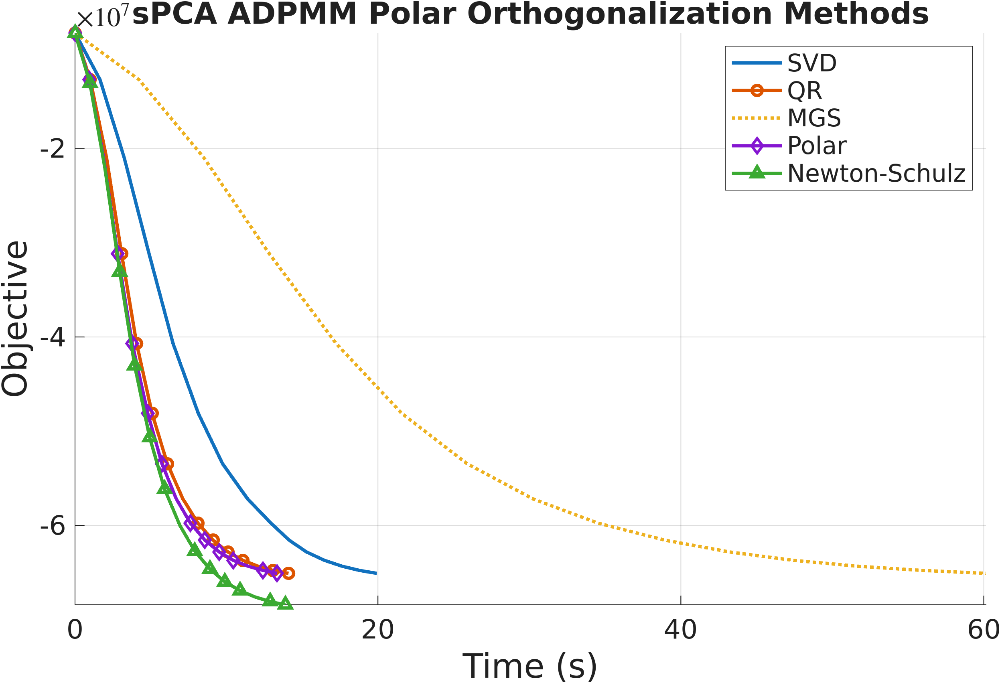
  <figcaption>
    <em>
      <strong>Figure 1:</strong>
      Comparison of SVD vs alternative orthogonalization methods (QR, MGS, polar, Newton&ndash;Schulz) inside ADPMM. Vanilla SVD is accurate but takes more time.
    </em>
  </figcaption>
</figure>

## Experimental Results

We evaluate two instances of the framework: **SVD-ADPMM** (exact Stiefel projection) and **NS-ADPMM** (Newton–Schulz projection) against five state-of-the-art manifold baselines: ManPG, ManPG-Ada, RADMM, ARADMM, and OADMM. Datasets span text (News20, RCV1), images (MNIST, USPS), citation/collaboration/social graphs (Cora, ca-GrQc, Facebook), and synthetic problems with planted structure. All methods share the same fixed random initialization; we set $\rho=\lambda_{\max}(\am^\top\am)$ for SPCA and $\rho=\tfrac{1}{2}\lambda_{\max}(\lm)$ for SSC. Both formulations are minimizations, so **lower curves are better**.

On News20, OADMM matches our methods per *iteration*, but it pays for each iteration with a backtracking line search on the manifold, requiring repeated retractions and augmented-Lagrangian evaluations. The wall-clock plots tell the real story: NS-ADPMM and SVD-ADPMM converge significantly faster in time than every baseline.

<figure style="text-align:center;">
  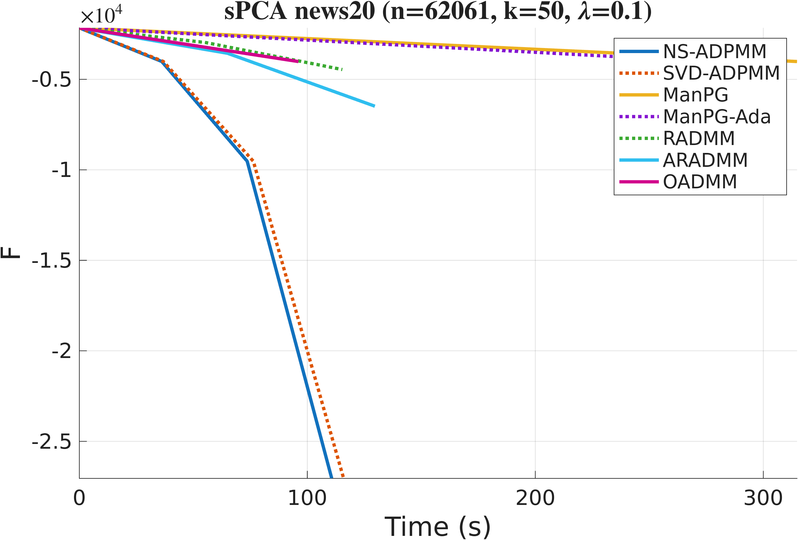
  <figcaption>
    <em>
      <strong>Figure 2:</strong>
      Sparse PCA on News20 (n=15,935, p=k=50): objective versus wall-clock time.
    </em>
  </figcaption>
</figure>

<figure style="text-align:center;">
  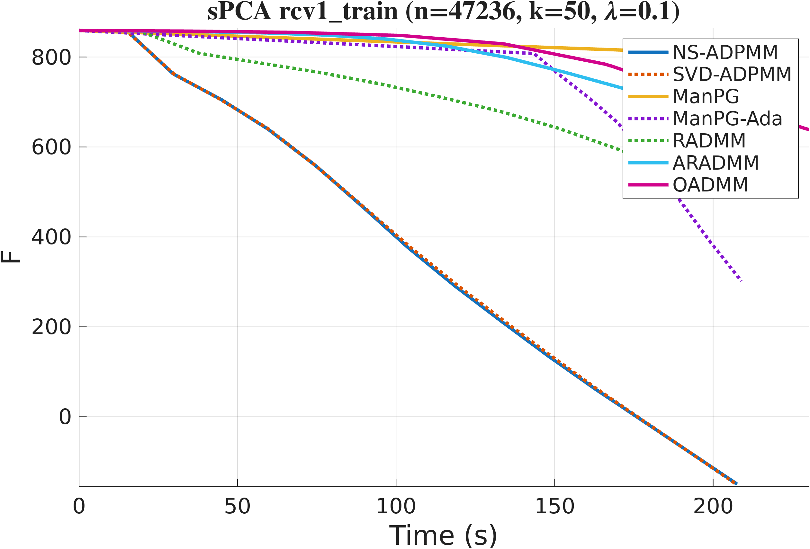
  <figcaption>
    <em>
      <strong>Figure 3:</strong>
      Sparse PCA on RCV1 (n=47,236, p=k=50), stressing scalability in the feature dimension.
    </em>
  </figcaption>
</figure>

For Sparse Spectral Clustering we build Gaussian similarity graphs with bandwidth set to the median squared pairwise distance. On both MNIST and USPS, ADPMM with either projection variant converges to a lower objective in fewer iterations *and* less time than the baselines, with NS-ADPMM the most efficient.

<figure style="text-align:center;">
  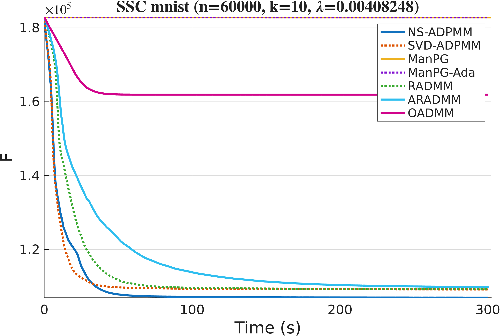
  <figcaption>
    <em>
      <strong>Figure 4:</strong>
      Sparse spectral clustering on MNIST (60,000 samples, 10 clusters): objective versus time.
    </em>
  </figcaption>
</figure>

<figure style="text-align:center;">
  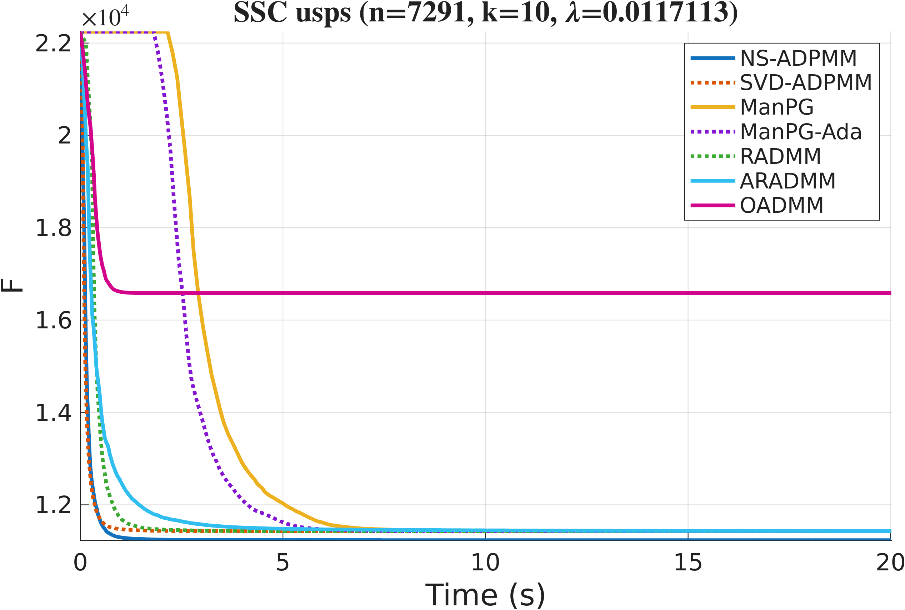
  <figcaption>
    <em>
      <strong>Figure 5:</strong>
      Sparse spectral clustering on USPS (7,291 samples, 10 clusters): objective versus time.
    </em>
  </figcaption>
</figure>

The same advantage carries over to real network graphs (ca-GrQc, Cora, Facebook), where the proposed methods reach competitive objective values while enforcing the orthogonality constraint *exactly*, and do so faster than the manifold baselines.

<figure style="text-align:center;">
  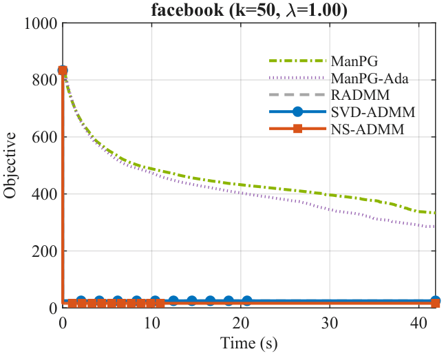
  <figcaption>
    <em>
      <strong>Figure 6:</strong>
      SSC on the Facebook ego-network graph (4,039 nodes, 88,234 edges, k=50): objective versus time.
    </em>
  </figcaption>
</figure>

Finally, sweeping the problem size, sparsity weight $\lambda$, and penalty $\rho$ on synthetic instances shows the methods maintain stable convergence and their efficiency advantage across all settings, indicating that ADPMM scales to large, high-dimensional problems.

<figure style="text-align:center;">
  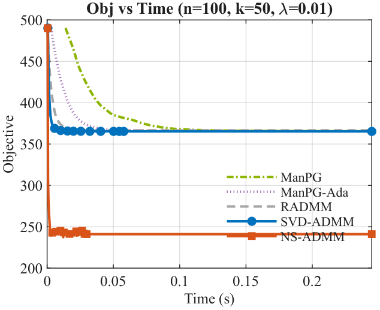
  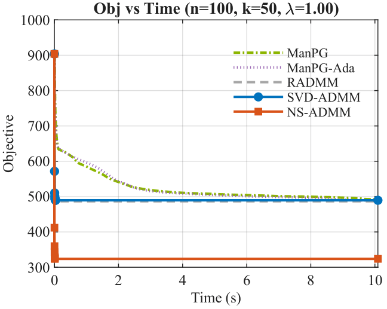
  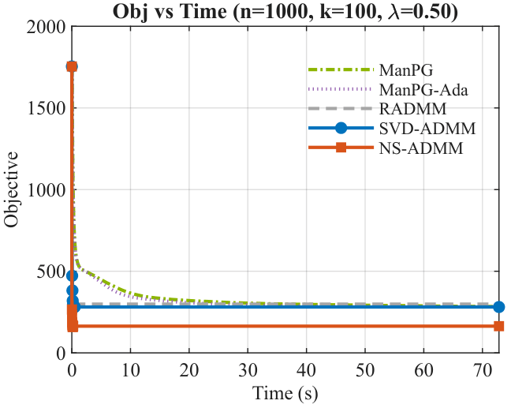
  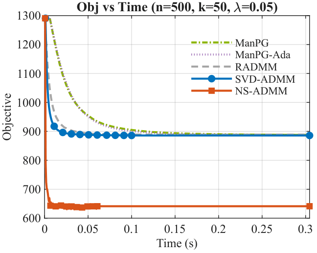
  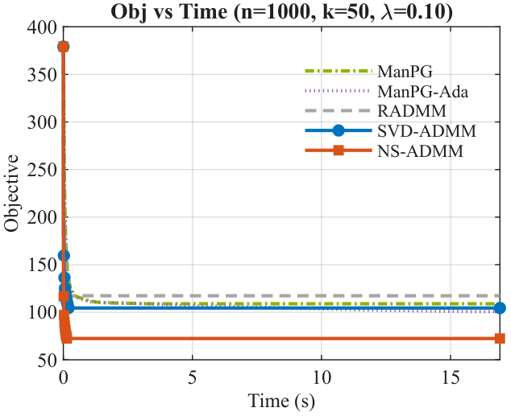
  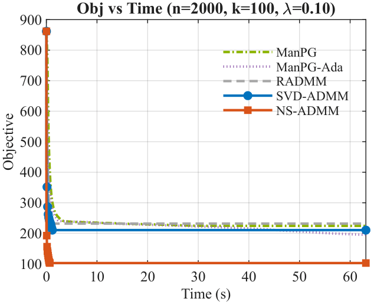
  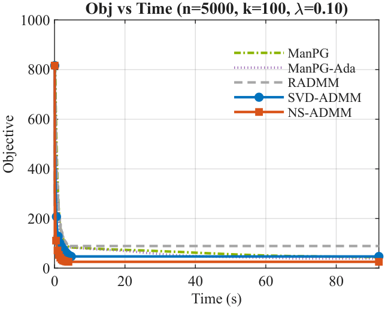
  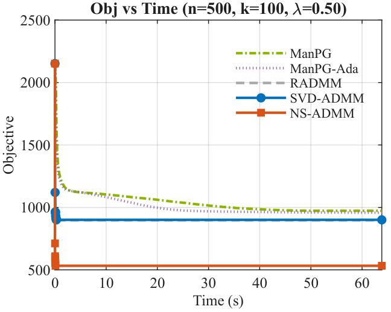
  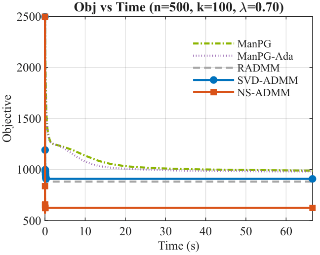
  <figcaption>
    <em>
      <strong>Figure 7:</strong>
      Objective versus time across problem scales ($n$ from 100 to 5{,}000) and parameter settings.
    </em>
  </figcaption>
</figure>

## References

 [1] Amir Beck. "First-order methods in optimization." SIAM, 2017.

 [2] Stephen Boyd et al. "Distributed optimization and statistical learning via the alternating direction method of multipliers." Foundations and Trends in Machine Learning, 2011.

 [3] Shixiang Chen et al. "Proximal gradient method for nonsmooth optimization over the Stiefel manifold." SIAM Journal on Optimization, 2020.

 [4] Nicholas J. Higham. "Functions of matrices: theory and computation." SIAM, 2008.

 [5] Keller Jordan et al. "Muon: An optimizer for hidden layers in neural networks." 2024.
